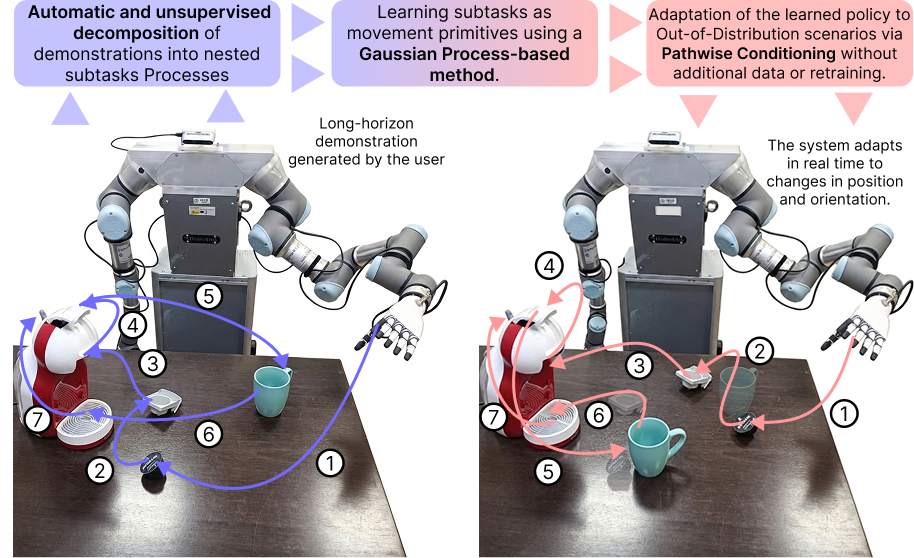
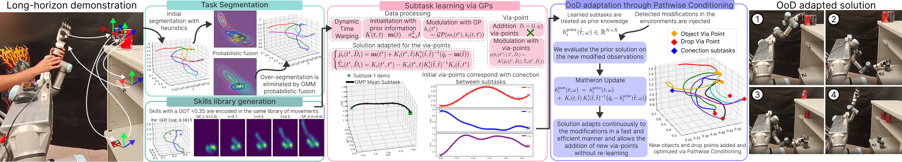
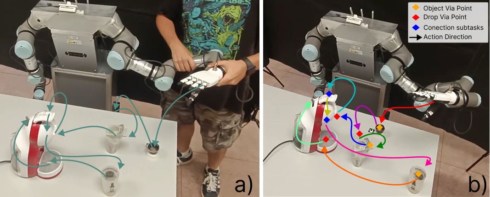

# **Learn Once, Adapt Anytime: Unifying Explicit Segmentation and Pathwise Conditioning for Long-Horizon Manipulation**

<p align="center">
  
</p>

To effectively execute long-horizon manipulation tasks in dynamic environments, robots must possess the capability to rapidly adapt to novel and changing situations. Techniques such as Learning from Demonstration (LfD) enable intuitive skill acquisition without explicit coding. However, scaling these methods to extended multi-step tasks exposes critical limitations, as compounding errors constrain their ability to generalize to unforeseen Out-of-Distribution (OoD) scenarios.

In this work, we present a probabilistic framework that combines a kinematically-driven task decomposition approach with movement primitive learning based on Gaussian Processes (GPs). To ensure robust execution across the entire task horizon, the algorithm incorporates a zero-shot adaptation mechanism to new via-points without requiring retraining, through Pathwise Conditioning. This approach dynamically sequences and adapts each subtask segmented on the fly, preserving continuity and smooth transitions across the long-horizon trajectory.

Website project: [https://adrianprados.github.io/LongHorizonPathwise/](https://adrianprados.github.io/LongHorizonPathwise/)  
Repository: [https://github.com/AdrianPrados/LongHorizonPathwise](https://github.com/AdrianPrados/LongHorizonPathwise)

---

# Installation
To be used on your device, follow the installation steps below.

## Install miniconda (highly-recommended)
It is highly recommended to install all the dependencies on a new virtual environment. For more information check the conda documentation for [installation](https://conda.io/projects/conda/en/latest/user-guide/install/index.html) and [environment management](https://conda.io/projects/conda/en/latest/user-guide/tasks/manage-environments.html). For creating the environment use the following commands on the terminal:

```bash
conda create -n LongHorizonPathwise python=3.10.18
conda activate LongHorizonPathwise
```
### Install repository

Clone the repository in your system and install required packages:

```bash
git clone https://github.com/AdrianPrados/LongHorizonPathwise.git
cd LongHorizonPathwise
pip install -r requirements.txt
```
---
# **Third-party dependencies**

To completely use our code, you need to take a look at these other repositories and dependencies:

- `ADAMSim` (https://github.com/Mobile-Robots-Group-UC3M/AdamSim): Simulator for the ADAM bimanipulator robot in PyBullet. Exact model of the real robot ADAM. This repository contains the URDF files and the necessary code to simulate the robot in PyBullet.

- `ArucoDetection` (https://github.com/Mobile-Robots-Group-UC3M/ArucoDetection): Code for the detection of ArUco markers using OpenCV. This repository contains the necessary code to detect ArUco markers in images and estimate their pose, including transformations to PyBullet coordinates.

- `Pathwise Conditioning` (https://github.com/AdrianPrados/GaussianPathwiseLfD): Implementation of Pathwise Conditioning for Gaussian Processes using our Pathwise Conditioning implementation.


---


# **Algorithm execution**

<p align="center">
  
</p>

In this repository, we present the complete pipeline for long-horizon Learning from Demonstration, unsupervised task segmentation, skill library generation, and zero-shot trajectory adaptation. The main files are:


### **1. Task Segmentation & Skill Library**

- `TaskSegmentation.py`: Kinematics-based unsupervised task segmentation using velocity, acceleration, and jerk profiles combined with Gaussian Mixture Models (GMM) to segment long-horizon demonstrations into atomic skills.

- `LibraryGeneration.py`: Groups extracted subtasks into reusable skill movement libraries using Gaussian Optimal Transport (GOT) distance metrics.


### **2. Movement Primitive Learning**

- `GPLearning.py`: Learns probabilistic movement primitives using Gaussian Processes with Dynamic Time Warping (DTW) temporal alignment and heteroscedastic noise handling.


### **3. Pathwise Conditioning & Zero-Shot Adaptation**

- `PathwiseAdaptation2D.py`: Example of 2D long-horizon pathwise conditioning for adapting trajectories to new via-points without retraining.

- `PathwiseAdaptation3D.py`: Example of 3D positional and rotational (6D) adaptation of learned movement primitives to novel spatial constraints.

- `InteractiveLongHorizon3D.py`: Interactive 3D visualization tool where you can move target via-points in real time with the mouse to observe continuous long-horizon trajectory adaptation.


### **4. Simulation & Benchmarks**

- `FrankaKitchenSim.py`: Long-horizon manipulation experiments in the Franka Kitchen PyBullet environment.

- `FrankaLHTSim.py`: Benchmarks on long-horizon manipulation tasks across simulated environments.


### **5. Real Robot Deployment**

- `ADAMInteractive.py`: Interactive mode with the ADAM robot in PyBullet simulation.

- `ArucoADAMLongHorizon.py`: Real-world deployment on the ADAM robot platform using ArUco markers and a RealSense camera for real-time 6D target tracking and zero-shot trajectory adaptation.


> [!NOTE]  
> For the scripts that require a camera to detect ArUco markers, an Intel RealSense D435i camera was used. Any OpenCV-compatible camera can be used with appropriate configuration.


> [!NOTE]  
> The code is under active maintenance and revision. If you detect any issues, please create an Issue on GitHub :construction_worker:.


---


### **Experiments with robot manipulator**

To test the efficiency of the algorithm, experiments were conducted in both PyBullet benchmarks and on a real dual-arm robotic platform (ADAM). Real-time corrections to via-points are applied using ArUco markers detected with a RGB-D camera.


<p align="center">
  
</p>

For full details and supplementary material, visit our Project Webpage (https://adrianprados.github.io/LongHorizonPathwise/).


---


# Citation

If you use this code or method in your research, please cite our paper: